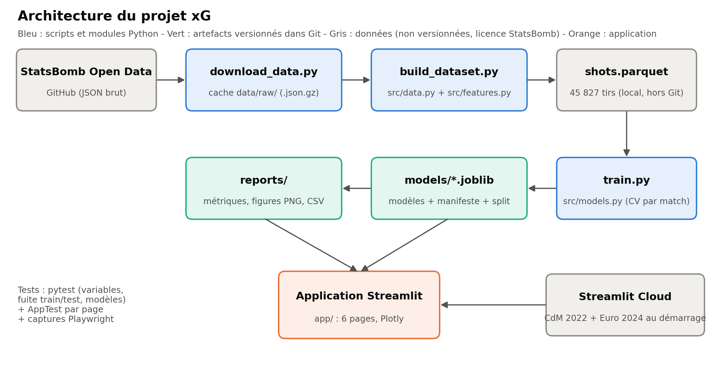

# xG Foot : estimation des buts attendus par machine learning

Projet du mémoire de Master 2 (IPSSI) : *« L'estimation des buts attendus (xG) en football par
machine learning et une application web »*.

Le dépôt contient le pipeline complet : téléchargement des données StatsBomb Open Data, table des
tirs et variables explicatives, entraînement et évaluation de modèles xG, application Streamlit en
six pages, tests automatisés et captures d'écran.

> **Données : StatsBomb Open Data (https://github.com/statsbomb/open-data)**



## Résultats principaux (jeu de test : 373 matchs, 9 174 tirs, jamais vus à l'entraînement)

| Modèle | Variables | ROC-AUC [IC 95 %] | Brier [IC 95 %] | Log-loss |
|---|---|---|---|---|
| Baseline (fréquence moyenne) | - | 0,500 | 0,0878 [0,0825 ; 0,0928] | 0,3190 |
| Régression logistique | simple | 0,793 [0,778 ; 0,809] | 0,0751 | 0,2641 |
| Gradient boosting (HistGB) | simple | 0,796 [0,782 ; 0,812] | 0,0754 | 0,2636 |
| Régression logistique | enrichi | 0,810 [0,795 ; 0,825] | 0,0734 | 0,2567 |
| Forêt aléatoire | enrichi | 0,815 [0,801 ; 0,830] | 0,0721 | 0,2528 |
| **Gradient boosting (HistGB)** - modèle principal | enrichi | **0,819 [0,805 ; 0,834]** | **0,0719 [0,0677 ; 0,0761]** | **0,2517** |
| XGBoost (comparaison) | enrichi | 0,820 [0,806 ; 0,835] | 0,0720 | 0,2515 |
| xG StatsBomb (référence externe) | - | 0,821 [0,807 ; 0,836] | 0,0714 [0,0670 ; 0,0756] | 0,2509 |

Toutes les valeurs proviennent de [`reports/metrics.csv`](reports/metrics.csv) et
[`reports/metrics.json`](reports/metrics.json). Le tableau complet, relié aux sections du mémoire,
est dans [`docs/CHAPITRES.md`](docs/CHAPITRES.md).

## Installation sous Windows (PowerShell)

Prérequis : Python 3.10 à 3.12 et Git. Le projet a été développé avec Python 3.12.10.

```powershell
git clone https://github.com/elkhellafanass/xg-foot-app.git
cd xg-foot-app
python -m venv .venv
.\.venv\Scripts\Activate.ps1
python -m pip install --upgrade pip
pip install -r requirements-dev.txt
```

Si PowerShell refuse d'activer l'environnement (« l'exécution de scripts est désactivée »), lancez
une seule fois `Set-ExecutionPolicy -Scope CurrentUser RemoteSigned`, ou appelez directement
`.\.venv\Scripts\python.exe` à la place de `python`.

- `requirements.txt` contient les dépendances d'exécution, utilisées aussi par Streamlit Cloud.
- `requirements-dev.txt` ajoute pytest, ruff, Playwright et XGBoost.

## Utilisation

```powershell
# 1. Téléchargement des données (environ 540 Mo compressés dans data\raw\, quelques minutes).
#    Relancer la commande reprend là où elle s'était arrêtée.
python scripts\download_data.py            # ou --only-wc2022 pour un essai rapide

# 2. Table des tirs + résumé du jeu de données
python scripts\build_dataset.py            # -> data\processed\shots.parquet, reports\dataset_summary.csv

# 3. Entraînement, calibration, évaluation, figures (environ 6 minutes sur un PC portable)
python scripts\train.py                    # -> models\, reports\, reports\figures\

# 4. Application
streamlit run app\streamlit_app.py         # http://localhost:8501

# 5. Tests et qualité
python -m pytest
ruff check .

# 6. Captures d'écran (l'application doit tourner sur le port 8599)
streamlit run app\streamlit_app.py --server.port 8599
python -m playwright install chromium      # une seule fois
python scripts\screenshots.py              # -> docs\screenshots\

# 7. Schéma d'architecture
python scripts\make_architecture.py        # -> docs\architecture.png
```

L'application ne ré-entraîne jamais les modèles : elle charge `models/*.joblib` et les fichiers de
`reports/`. Si un fichier manque, elle affiche un message indiquant la commande à lancer.

## Organisation du dépôt

```
app/                 application Streamlit (streamlit_app.py + views/ : 6 pages)
app/assets/          emplacement du logo StatsBomb (à ajouter, voir plus bas)
src/                 config.py, data.py (téléchargement, extraction des tirs), features.py,
                     models.py (pipelines, calibration, bootstrap), viz.py (palette)
scripts/             download_data.py, build_dataset.py, train.py, screenshots.py, make_architecture.py
models/              modèles entraînés (.joblib), manifest.json, split.json (identifiants des matchs)
reports/             metrics.csv/json, dataset_summary.csv, permutation_importance.csv,
                     error_analysis.csv, error_examples.csv, figures/ (PNG 300 dpi)
docs/                CHAPITRES.md, architecture.png, screenshots/
tests/               pytest (variables, données, modèles, fuite train/test, pages Streamlit)
data/                NON versionné : raw/ (cache JSON), processed/ (table des tirs)
```

## Choix réalisés (et pourquoi)

| Sujet | Choix | Raison |
|---|---|---|
| Données dans Git | **Aucune** donnée brute ni table de tirs | La licence StatsBomb (§1.2.1 et §7) interdit de « distribuer, reproduire ou fournir les données à un tiers » sans accord écrit. Seuls le code, les modèles et des résultats agrégés sont versionnés. |
| Données en ligne | L'application déployée télécharge la CdM 2022 et l'Euro 2024 au premier lancement (environ 10 s, cache disque) | Cartes et tableaux restent possibles sans redistribuer les données. Les métriques affichées portent sur le jeu complet, calculé en local. |
| Compétitions | CdM 2018 et 2022, Euro 2020 et 2024, Copa América 2024, CAN 2023, et les cinq grands championnats en 2015/2016 | Compétitions masculines intégralement couvertes, pour un volume suffisant (45 827 tirs). La Bundesliga 2015/2016 ne compte que 34 matchs publiés. |
| Exclusions | Penalties (523) et tirs au but (241) | Leur probabilité ne dépend pas de la position de tir. Ils sont tout de même comptés dans le score avant chaque tir (sauf les tirs au but). |
| Découpage | Par match : test 20 %, calibration 20 % du reste, graine 42 | Évite les fuites entre tirs d'un même match. Un test vérifie l'absence de match commun. |
| Réglage | GridSearchCV + GroupKFold(5), critère log-loss | Validation croisée groupée par match. |
| Recalibrage | Méthode (aucune, Platt ou isotonique) choisie par GroupKFold sur l'ensemble de calibration | Lors d'un premier essai, Platt appliqué d'office dégradait les modèles à arbres (XGBoost enrichi : log-loss 0,2603 contre 0,2516 sans calibration). La sélection a retenu « aucune » pour tous les modèles. |
| Modèle principal | HistGradientBoosting, choisi sur la log-loss en validation croisée (jamais sur le test) | XGBoost est évalué mais exclu de ce choix, car il n'est pas installé sur Streamlit Cloud (son wheel Linux tire environ 200 Mo de dépendances CUDA). |
| xG StatsBomb | Jamais utilisé comme variable | Il sert uniquement de référence externe (un test le vérifie). |

## Logo StatsBomb (à faire à la main)

La licence impose d'afficher le logo StatsBomb sur toute publication d'analyses.

1. Téléchargez-le depuis le Media Pack : https://statsbomb.com/media-pack/
2. Enregistrez-le en PNG sous **`app/assets/statsbomb_logo.png`** (nom exact).
3. Il s'affichera automatiquement dans la barre latérale et sur la page « Méthodologie et sources ».
   Tant qu'il est absent, un texte indique l'emplacement prévu.
4. Commitez le fichier : `git add app/assets/statsbomb_logo.png`, puis `git commit` et `git push`.

## Licence des données

StatsBomb Public Data User Agreement (mis à jour le 8 septembre 2023) :

- usage de recherche et d'analyse, sans exploitation commerciale ;
- citer StatsBomb et afficher son logo dans toute publication ;
- ne pas redistribuer les données ;
- données fournies « en l'état », sans garantie.

StatsBomb demande aussi aux utilisateurs de s'enregistrer sur https://www.statsbomb.com/resource-centre.

## Déploiement

Voir [`DEPLOY.md`](DEPLOY.md) pour Streamlit Community Cloud.
